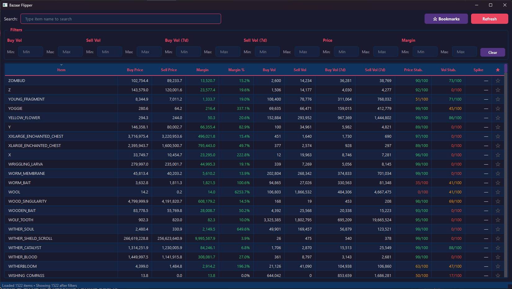

# PyZaar - Hypixel Skyblock Bazaar Flipper

Welcome to **PyZaar**, a desktop application built with Python and PySide6 designed to help Hypixel Skyblock players find the best items to flip on the Bazaar!

This tool fetches real-time bazaar data from the Hypixel Skyblock API, processes the raw metrics into actionable insights (like margin percentages, volume stability, and spike detection), and presents it in a sleek, dark-themed, and highly filterable data grid.



## Features

- **Real-Time Data**: Fetches and caches live bazaar data directly from the Hypixel API.
- **Advanced Analytics**: Automatically calculates metrics like:
  - Buy/Sell Profit Margins
  - 7-Day Moving Volumes
  - Price and Volume Stability Scores (0-100)
  - Price Spike Detection to warn about market manipulation (⚠️ SPIKE)
- **Powerful Filtering & Search**: Find exact items instantly or filter the market by price boundaries, minimum volumes, and required margins.
- **Bookmarking System**: Star (★) your favorite items to keep them in a dedicated watch list that persists between sessions.
- **Modern User Interface**: A responsive and aesthetic dark-mode UI powered by PySide6.

## Prerequisites & Dependencies

To run this application, you need Python 3.13+ and the following external libraries:

- **`requests`**: For fetching data from the Hypixel API.
- **`python-dotenv`**: For loading your API key from a secure `.env` file.
- **`pyside6`**: For rendering the graphical desktop interface.

## Setup and Installation

1. **Install Dependencies**
   If you manage the project via `uv`, the dependencies have been added to your `pyproject.toml`. You can simply sync them:
   ```bash
   uv sync
   ```
   *Alternatively, if you haven't synced yet, you can add them manually with:* `uv add requests python-dotenv pyside6`.

   If you prefer using `pip`, you can install the required packages directly:
   ```bash
   pip install requests python-dotenv pyside6
   ```

2. **Configure Your API Key**
   Create or open the `.env` file in the root directory and add your Hypixel API key:
   ```env
   API_KEY=your_personal_hypixel_api_key_here
   ```
   *(Note: The application will still attempt to run without an API key, but you may face strict rate limits from the Hypixel API).*

3. **Run the Application**
   Launch the user interface using:
   ```bash
   uv run visualize.py
   ```

## Development and Architecture

- **`visualize.py`**: Contains the PySide6 UI definitions, table models, filtering proxies, and the main application loop.
- **`bazaarFetch.py`**: Handles all the API requests, caching logic, error retries, and data crunching/analytics algorithms.
- **`bookmarks.json`**: Automatically generated file that stores your starred items locally.

## Disclaimer

This is a third-party application not affiliated with or endorsed by Hypixel. Use responsibly and respect API rate limits.
# PyZaar
